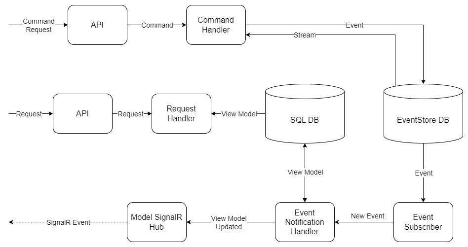
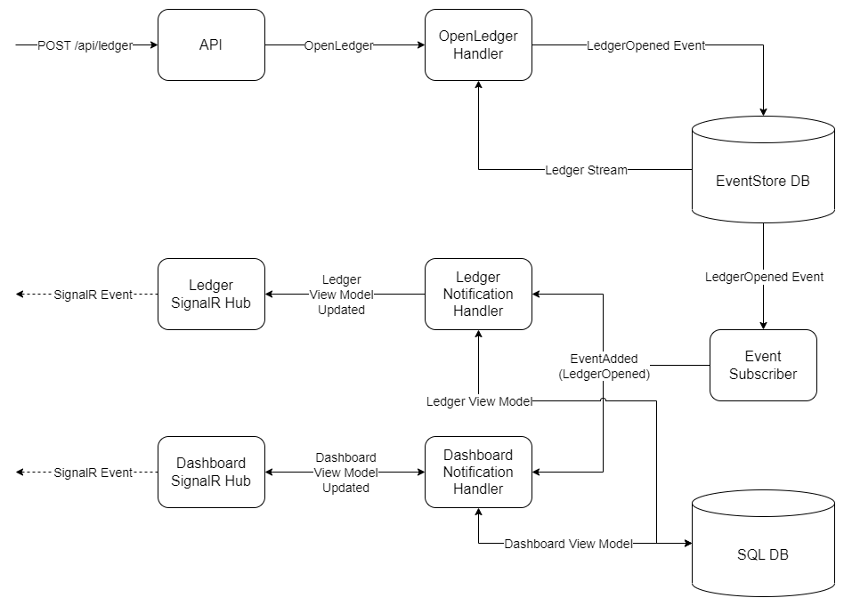

# ledger-es
An exaple ledger management system built to demonstrate event sourcing and event-driven architecture.

# Getting Started
Bring the docker project up from the command line by changing into the root directory of the project and running the following command:

    docker compose up -d

The SQL Server instance should automatically bring up the database schema defined in [schema.sql](volumes/mssql/schema.sql).

Navigate to the project web interface at http://localhost:8080

## Debugging & Developing
To run just the databases start docker with the following command:

    docker compose up eventstore.db mssql -d

The API project [Js.LedgerEs.csproj](src/Js.LedgerEs/Js.LedgerEs.csproj) can then be started/debugged in Visual Studio as normal and the frontend can be started from the command line with `npm run dev`.

### EventStore
The EventStore management interface runs at http://localhost:8081

### SQL Server
The SQL Server instance can be connected to with the connection string `Data Source=localhost,1434;User Id=sa;Password=X13ppP2prRi6fPmW;`

# Architecture
The solution is organised into vertical feature slices. The domain features "Ledgers" and "Dashboard" implement the CQRS pattern. Commands use event sourcing to persist changes, while Queries connect to a regular RDBMS to return results. There is a hosted service that subscribes to the event database, and it is responsible for listening to new events and synchronising state to the RDBMS (a process called [projection](https://www.eventstore.com/event-sourcing#Projections)).

This architecture is illustrated below:

A concrete example of the architecture is when processing a request to open a ledger. In this example, once the ledger is successfully opened 2 different view models are updated and synced with the SQL database:

# References
 1. The EventStore website has a [good overview](https://www.eventstore.com/event-sourcing) of event sourcing and how it relates to patterns such as CQRS and DDD.
 2. The EventStore github [samples repository](https://github.com/EventStore/samples) is a good resource on how to integrate EventStoreDB with other databases for storing view models
